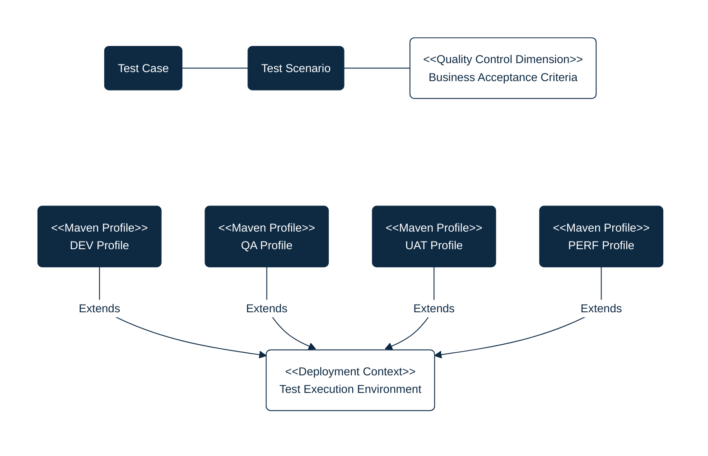

## PURPOSE
Repository dedicated to the quality control projects (e.g; testing applications implementing test scenario plans), with mission to evaluate and report the quality of CYBNITY software components and systems versions.

You can find informations relative to test plans maintenance like:
- Design diagrams regarding organization of test plans and eventual dependencies
- Support to test plans execution according to execution environments targeted
- Test software developed and maintained as test plans reusable Non-Regression quality control systems

# QUALITY CONTROL DIMENSIONS
The quality control of CYBNITY applications and features is structured for allow flexible execution according to many stage of a project, and the test plans structure is based on dissimenated scope of test types.

Find here an overview of the test elements and categories which are implemented over dedicated projects.

