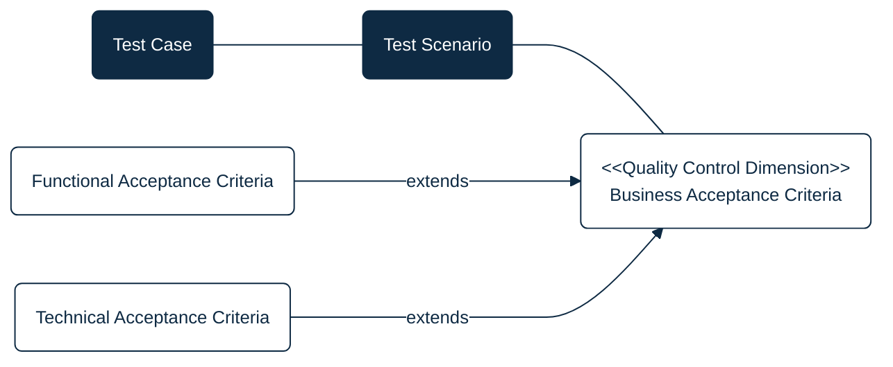
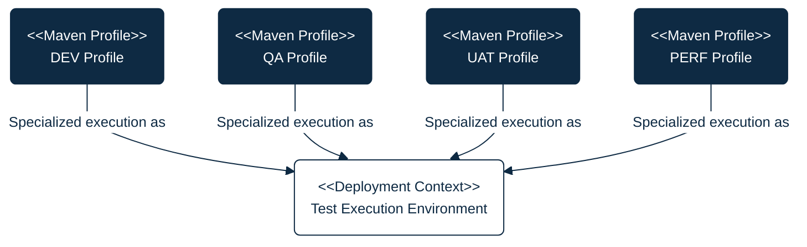
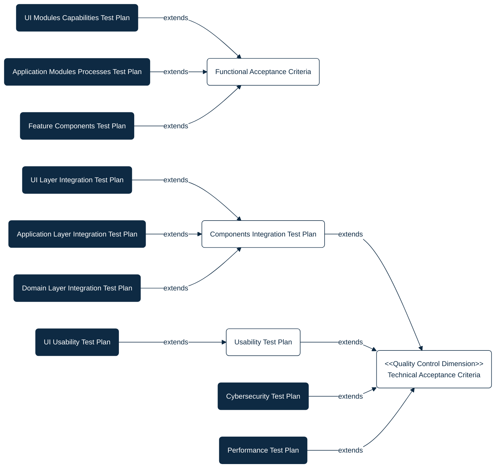

## PURPOSE
Repository dedicated to the quality control projects (e.g; testing applications implementing test scenario plans), with mission to evaluate and report the quality of CYBNITY software components and systems versions.

You can find informations relative to test plans maintenance like:
- Design diagrams regarding organization of test plans and eventual dependencies
- Support to test plans execution according to execution environments targeted
- Test software developed and maintained as test plans reusable Non-Regression quality control systems

# QUALITY CONTROL PROJECTS

WHAT ACCEPTANCE CRITERIA MANAGED?

## Business Acceptance Criteria
A Business Acceptance Criteria is defining the business needs and linked expectations for each business process, IT operational services or CYBNITY solutions, allowing to maintain their quality control measured by acceptance criteria.

This type of artifact capture the quality acceptance eligible to inclusion into tested solution SLAs.

One or several business acceptance criteria can be linked to a Test Scenario to validate the quality of a feature and/or a system.

WHAT CONTEXTUAL CONDITIONS FOR TEST EXECUTION?

  
## Test Environments
Each test plan can be executed into an infrastructure dedicated to a stage of development, with specific requirements in terms of clusterized environment where it shall be executed.

For allow distribution of executed test plans during the quality control types need during a CYBNITY Solution versions to evaluate, several customizations of tests execution context are defined and managed via Maven Profiles which can be selected by the tester (or by Continuous Integration pipeline).

## TEST PLANS
The quality control of CYBNITY applications and features is structured for allow flexible execution according to many stage of a project, and the quality control plan structure is based on dissimenated scope via test plans.

Each test plan is implemented as an executable Java application component (e.g. JUnit project, using a Maven Profile targeting the condition of execution to apply), defining a set of test scenario and cases to execute, and generating a results report.

Find here an overview of the categorized test plans which are implemented over dedicated sub-projects.

### Functional Dimension
Quality control plans ensuring to verify that CYBNITY components have expected behavior and deliver services in conformity with functional requirements.

|Quality Plan Project|Tested Perimeter|Quality Control Goal|Reference Requirements|
|:----------------|:---------------|:-------------------|:---------------------|
|UI Modules Capabilities Test Plan|CYBNITY deployable [cockpit-foundation components](https://github.com/cybnity/foundation/tree/main/implementations-line#cockpit-foundation-components)|Frontend user interface capabilities behavior|[Information system requirements](https://cybnity.notion.site/BAI02-01-Information-Systems-Functional-Requirements-7e1a0c857160495c9c4e7a6a072824af?source=copy_link)|
|Application Modules Processes Test Plan|CYBNITY deployable [application components](https://github.com/cybnity/foundation/tree/main/implementations-line#application-components)|Applicative processes conformity per security domain| |
|Feature Components Test Plan|CYBNITY common/shared/embedded features libraries behavior|Services component behavior expected per component category (e.g domain, OS, physical, transport, workflow) extending already existing any standalone unit test (managed in each software dedicated project) when test case require complementary 3rd-party system (e.g physical device, network equipment, 3rd-party system)| |

### Technical Dimension
Quality control plans validating criteria relative to non-functional requirements that are expected from CYBNITY components.

#### Integration Acceptance
|Quality Plan Project|Tested Perimeter|Quality Control Goal|Reference Requirements|
|:----------------|:---------------|:-------------------|:---------------------|
|UI Layer Integration Test Plan|CYBNITY deployable UI Layer components|Technical integration conformity from UI Layer area with Application Layer and-or with external system (e.g. 3rd-party APIs or I/O external solutions) elements| |
|Application Layer Integration Test Plan|CYBNITY deployable Application Layer components|Technical integration conformity from Application Layer elements with Domain Layer (e.g connectivity protocol, ontologies, deployment settings)| |
|Domain Layer Integration Test Plan|CYBNITY deployable Domain Layer components|Technical integration conformity from Domain Layer elements with Infrastructure Layer (e.g persistence protocols, virtualized services, coupling with 3rd-party reused open source software| |

#### Security Acceptance
The tested abilities via the security quality control plan is focused on conformity of features that ensure that "CYBNITY Solution components work is executed in a safe context".

Several sub-domains of security category checks can be extended over dedicated test plans or test scenario focused on:
- Recovery Time Objective (RTO): maximum allowable time to restart a component
- Recovery Point Objective (RPO): maximum acceptable loss of data after restart
- Availability: service is operational for the time period expected
- Integrity: consistency, reliability and relevance of data ensured
- Confidentiality: information managed is accessible only to those whose access is authorized
- Traceability: level of information necessary and sufficient to know (and retrospectively) the composition of a material or component throughout its chain of production, its distribution and its usage

|Quality Plan Project|Tested Perimeter|Quality Control Goal|Reference Requirements|
|:----------------|:---------------|:-------------------|:---------------------|
|Cybersecurity Test Plan|CYBNITY deployable Solution security controls|Behavior of security measures and features responding to security requirements expected from CYBNITY components| |

#### Performance Acceptance
The feature performance is focused by this type of test plan, with quality check from end-user point of view. Each performance acceptance criteria defines that a feature or capability or system give satisfaction regarding a performance level during its execution, ensuring that the "work execution is done with efficiency".

|Quality Plan Project|Tested Perimeter|Quality Control Goal|Reference Requirements|
|:----------------|:---------------|:-------------------|:---------------------|
|Performance Test Plan|CYBNITY deployable Solution|Performance checking in terms of capability to serve (scalability), with stable service level (robustness) in a expected duration (reactivity)| |

#### Usability Acceptance
A feature usability through a solution component (e.g. frontend user interface or extended interface like Chat, Vocal, AI Prompt) is targeted by this type of acceptance plan to validate the expected level of usage facility.

Usability acceptance criteria implemented defines the degree to which a feature or system can be used by specified consumers to achieve quantified objectives with effectiveness, efficiency, and satisfaction in quantified context of user that ensure that "work is easy to understand and to do".

Several sub-domains of usability dimension checks can be extended over dedicated test plans or test scenario focused on:
- Learnability: level of ease for users to accomplish basic tasks the first time they encounter the design
- Memorability: when users return to the design after a period of not using it, level of ease to re-establish proficiency
- Clearness: simplicity to understand how the user can interact with the system
- Concise: level of quantity of informations presented to the user to not to fail into the trap of over-clarifying
- Familiarity: something which appears like something else the user had encountered before
- Responsive: the interface talk back to the user to inform him about what's happening
- Consistency: the level of consistency that an interface should maintain throughout the user experience in a application context
- Attractive: the fashing level of the look and of the feel regarding the interface for the audience
- Efficiency: the interface figures out what exactly the user is trying to achieve, and then lets him fo exactly that without any fuss
- Forgiving: that can save the user from costly mistakes (for example, if someone deletes an important piece of information, can he easily retrieve it or undo this action)
- Readable: the interface is easy to read for the audience in the context of usage

|Quality Plan Project|Tested Perimeter|Quality Control Goal|Reference Requirements|
|:----------------|:---------------|:-------------------|:---------------------|
|UI Usability Test Plan|CYBNITY deployable [cockpit-foundation UI components](https://github.com/cybnity/foundation/tree/main/implementations-line#cockpit-foundation-components)|Frontend web user interface usabiility criteria conformity| |
