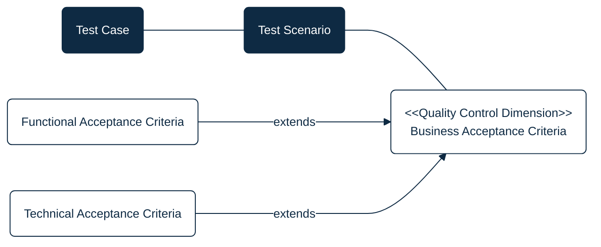
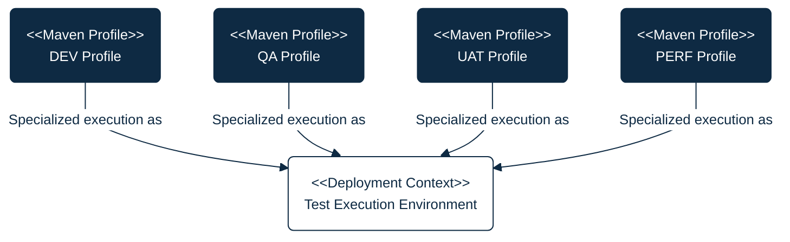
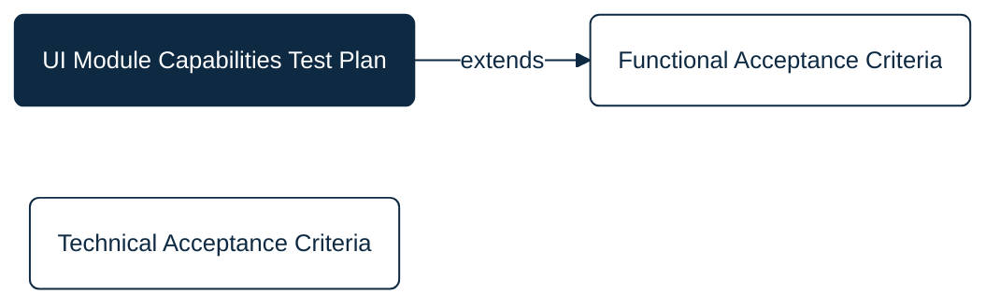

## PURPOSE
Repository dedicated to the quality control projects (e.g; testing applications implementing test scenario plans), with mission to evaluate and report the quality of CYBNITY software components and systems versions.

You can find informations relative to test plans maintenance like:
- Design diagrams regarding organization of test plans and eventual dependencies
- Support to test plans execution according to execution environments targeted
- Test software developed and maintained as test plans reusable Non-Regression quality control systems

# QUALITY CONTROL PROJECTS
## Business Acceptance Criteria
A Business Acceptance Criteria is defining the business needs and linked expectations for each business process, IT operational services or CYBNITY solutions, allowing to maintain their quality control measured by acceptance criteria.

This type of artifact capture the quality acceptance eligible to inclusion into tested solution SLAs.

One or several business acceptance criteria can be linked to a Test Scenario to validate the quality of a feature and/or a system.

## Test Environments
Each test plan can be executed into an infrastructure dedicated to a stage of development, with specific requirements in terms of clusterized environment where it shall be executed.

For allow distribution of executed test plans during the quality control types need during a CYBNITY Solution versions to evaluate, several customizations of tests execution context are defined and managed via Maven Profiles which can be selected by the tester (or by Continuous Integration pipeline).

## Test Plans
The quality control of CYBNITY applications and features is structured for allow flexible execution according to many stage of a project, and the quality control plan structure is based on dissimenated scope via test plans.

Each test plan is implemented as an executable Java application component (e.g. JUnit project, using a Maven Profile targeting the condition of execution to apply), defining a set of test scenario and cases to execute, and generating a results report.

Find here an overview of the categorized test plans which are implemented over dedicated sub-projects.

### Managed Plans
